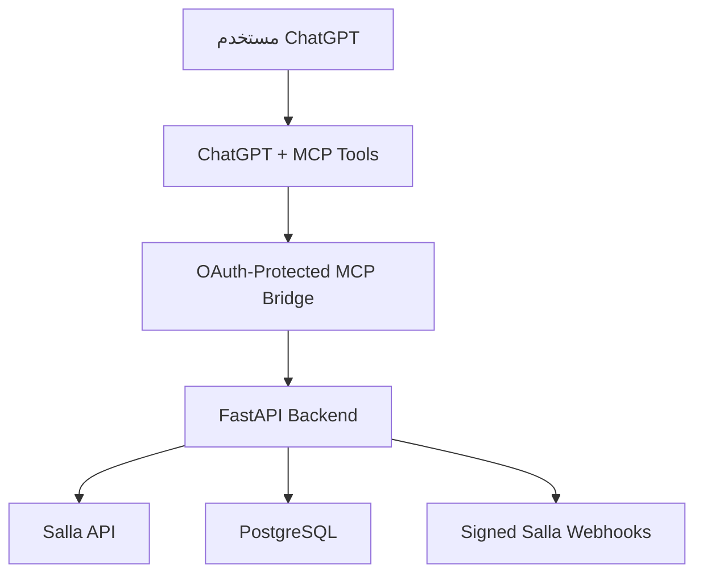

# SmartVision Growth Intelligence — Portfolio

> **Public project showcase and ownership evidence**  
> **ملف عرض عام وإثبات عمل وملكية المشروع**

[العربية](#نبذة-عن-المشروع) • [English](#project-overview)

---

## نبذة عن المشروع

**SmartVision Growth Intelligence** منصة ذكاء وتحليل مخصصة لمتاجر التجارة الإلكترونية. يهدف المشروع إلى ربط متجر **Salla** مع **ChatGPT** بصورة آمنة، بحيث يستطيع المستخدم الاستعلام عن بيانات المتجر وتحليل المنتجات والطلبات ودعم القرارات التشغيلية والنمو، من خلال أدوات MCP محمية بنظام OAuth.

هذا المستودع هو **نسخة عرض عامة فقط**. الكود التشغيلي، بيانات العملاء، رموز الوصول، مفاتيح API، أسرار OAuth، وإعدادات قواعد البيانات غير منشورة هنا.

## صاحب المشروع وإثبات الملكية

- **مالك المشروع ومدير المستودع:** [@smartvisionhub1-bit](https://github.com/smartvisionhub1-bit)
- **المستودع التشغيلي الأصلي:** خاص لحماية الكود والبيانات الحساسة.
- **الغرض من هذا المستودع:** توثيق فكرة المشروع، نطاقه، بنيته التقنية، ومساهمة صاحب الحساب دون كشف أسرار التشغيل.

سجل هذا المستودع وحساب GitHub المرتبط به يوضحان جهة إدارة نموذج الأعمال. راجع أيضًا [بيان الملكية](OWNERSHIP-STATEMENT.md).

## الهدف

إنشاء طبقة آمنة بين ChatGPT ومنصة Salla تمكّن من:

- التحقق من حالة الاتصال.
- قراءة المنتجات وعرضها بطريقة منظمة.
- قراءة الطلبات وتحليلها.
- توفير أساس لتقارير الأداء والنمو.
- حماية الوصول باستخدام OAuth 2.0 وصلاحيات قراءة محددة.
- تشفير رموز Salla الحساسة وتدوير رموز التجديد بصورة آمنة.

## نطاق العمل المنفذ

- تصميم بنية النظام وتدفق التكامل بين Salla وChatGPT.
- إعداد واجهة خلفية باستخدام FastAPI.
- إنشاء واجهة إدارة باستخدام Next.js.
- إعداد PostgreSQL وترحيلات قاعدة البيانات.
- إعداد تسجيل دخول إداري محمي.
- بناء MCP Bridge وربطه بتدفق OAuth.
- إنشاء أدوات MCP مثل:
  - `bridge_status`
  - `salla_products`
  - `salla_orders`
- التحقق من توقيع Webhook باستخدام HMAC-SHA256.
- تشفير رموز الوصول والتجديد الخاصة بـ Salla.
- إعداد اختبارات آلية وفحوص صحة وجاهزية.
- إعداد Docker وGitHub Actions والنشر المرحلي على Render.
- معالجة مشكلات جلسات OAuth وتجديد الاتصال والتوافق مع ChatGPT.

## البنية التقنية

## التقنيات المستخدمة

| المجال | التقنيات |
|---|---|
| الواجهة | Next.js, TypeScript |
| الواجهة الخلفية | Python, FastAPI |
| قاعدة البيانات | PostgreSQL, Alembic |
| التكامل | Salla API, Webhooks, MCP |
| الحماية | OAuth 2.0, HMAC-SHA256, Token Encryption |
| التشغيل | Docker, GitHub Actions, Render |
| الجودة | Automated Tests, Health Checks, Secret Scanning |

## حالة المشروع

المشروع في مرحلة تطوير واختبار مرحلي. تم إثبات تشغيل البنية الأساسية، OAuth، MCP، وأدوات الاتصال، بينما يستمر تحسين تجربة الاستخدام وموثوقية تكامل البيانات قبل أي إطلاق عام.

## حماية المعلومات

لا يتضمن هذا المستودع:

- كلمات مرور أو مفاتيح API.
- Client Secrets أو Webhook Secrets.
- Access Tokens أو Refresh Tokens.
- روابط قواعد بيانات خاصة.
- بيانات متاجر أو عملاء.
- الكود التشغيلي الكامل.

للمزيد، راجع [سياسة الأمان](SECURITY.md).

---

## Project Overview

**SmartVision Growth Intelligence** is an e-commerce intelligence platform designed to connect a **Salla** store securely with **ChatGPT**. It enables authorized, read-only access to store information through OAuth-protected MCP tools, supporting product, order, performance, and growth analysis.

This repository is a **public showcase only**. Production source code, customer data, credentials, OAuth secrets, tokens, and private infrastructure settings are intentionally excluded.

## Project Ownership

- **Project owner and repository maintainer:** [@smartvisionhub1-bit](https://github.com/smartvisionhub1-bit)
- The operational repository remains private for security and confidentiality.
- This repository documents the concept, scope, architecture, and implementation work without exposing protected assets.

See the formal [Ownership Statement](OWNERSHIP-STATEMENT.md).

## Implemented Capabilities

- FastAPI backend and protected administrative access.
- Next.js administration interface.
- PostgreSQL schema and database migrations.
- OAuth-protected MCP bridge for ChatGPT.
- MCP tools for bridge status, Salla products, and Salla orders.
- Signed Salla webhook verification using HMAC-SHA256.
- Encryption and safe rotation of Salla access and refresh tokens.
- Automated tests, health/readiness checks, Docker, GitHub Actions, and Render staging deployment.
- OAuth session, reconnection, and ChatGPT compatibility improvements.

## Project Status

The system is under active staged development and testing. Core infrastructure, OAuth, MCP connectivity, and tool execution have been established. Further reliability and user-experience work continues before public release.

---

© 2026 [smartvisionhub1-bit](https://github.com/smartvisionhub1-bit). All rights reserved.
